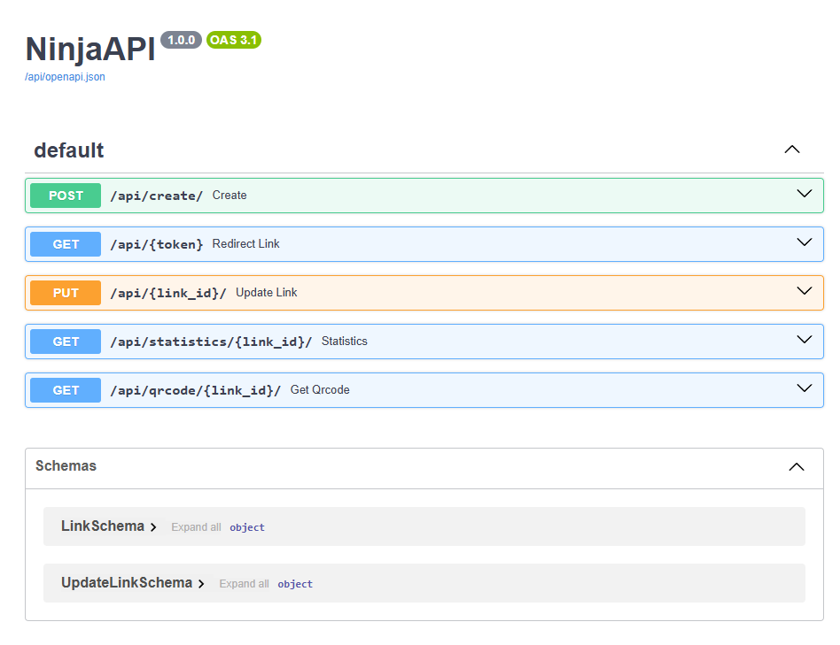

# psw-returnal-project-3
✂️ Encurtador de Links com Django Ninja | Projeto 3

<p>
  
  
  
  <a href="https://opensource.org/licenses/MIT">
    
  </a>
</p>

## Tópicos

- [Sobre o Projeto](#sobre-o-projeto)
- [Tecnologias](#tecnologias)
- [Instalação e Uso](#instalação-e-uso)
- [Licença](#licença)

<br>

## Sobre o Projeto

Este projeto foi desenvolvido durante a Semana do Canal Pythonando, sendo o terceiro de uma série de três projetos criados.  
O objetivo deste projeto é fornecer um **encurtador de links** funcional com suporte às seguintes funcionalidades:

- **Cadastrar novos links** com opções de:
  - Tempo de expiração.
  - Quantidade máxima de cliques únicos.
- **Atualizar links** cadastrados.
- **Redirecionamento automático** dos links encurtados.
- **Estatísticas** dos links:
  - Total de cliques únicos.
  - Total de cliques gerais.
- **Gerar QR Codes** para os links encurtados.
- **Desativação de links** a qualquer momento.

<br>

<p align="center">
  
</p>

<br>

## Tecnologias

As seguintes tecnologias e bibliotecas foram utilizadas no desenvolvimento do projeto:

- [Python](https://www.python.org/)
- [Django](https://www.djangoproject.com/) (framework web principal)
- [Django Ninja](https://django-ninja.rest-framework.com/) (para criação da REST API)
- [Pillow](https://python-pillow.org/) (manipulação de imagens)
- [QRCode](https://github.com/lincolnloop/python-qrcode) (geração de QR Codes)

<br>

## Instalação e Uso

### Pré-requisitos

- Python 3.x instalado no sistema (baixe [aqui](https://www.python.org/downloads/)).

### Passos para Configuração e Execução

1. **Clone o repositório**:

Abra seu terminal e clone o repositório do projeto:

  ```bash
  git clone https://github.com/yMiguelzin/psw-returnal-project-3.git

  ```
 
2. **Ative o ambiente virtual (opcional, mas recomendado)**:

  Navegue até a pasta do projeto e crie/ative um ambiente virtual:

  ```bash
  # Criar
    
  #Linux
  python3 -m venv venv
    
  #Windows
  python -m venv venv

  ```

Após a criação do venv vamos ativa-lo:

  ```bash
  #Ativar
  
  #Linux
  source venv/bin/activate
  
  #Windows
  venv\Scripts\Activate

  #Caso algum comando retorne um erro de permissão execute o código e tente novamente:
  Set-ExecutionPolicy -Scope CurrentUser -ExecutionPolicy RemoteSigned

  ```

3. **Instale as dependências**:

  Com o ambiente virtual ativo, instale todas as dependências necessárias:

  ```bash
  Copiar código

  pip install django
  pip install django-ninja
  pip install pillow
  pip install qrcode

  ```

4. **Configuração do Banco de Dados**:

  Aplique as migrações para configurar o banco de dados SQLite:

  ```bash
  #Dependências

  python manage.py makemigrations
  python manage.py migrate

  ```

5. **Execute o servidor de desenvolvimento localmente**:
   
Inicie o servidor de desenvolvimento para rodar a aplicação localmente:

  ```bash
  #Terminal

  python manage.py runserver
  O servidor será executado em http://localhost:8000/diario/
  Abra esse endereço no seu navegador para começar a usar a aplicação.

  ```

## Licença
<a href="https://opensource.org/licenses/MIT">
    
</a>

<br>

Esse projeto está sob a licença MIT. Veja o arquivo [LICENSE](/LICENSE) para mais detalhes.

---

Feito com ❤️ por [Miguel Marostica](https://github.com/yMiguelzin)
